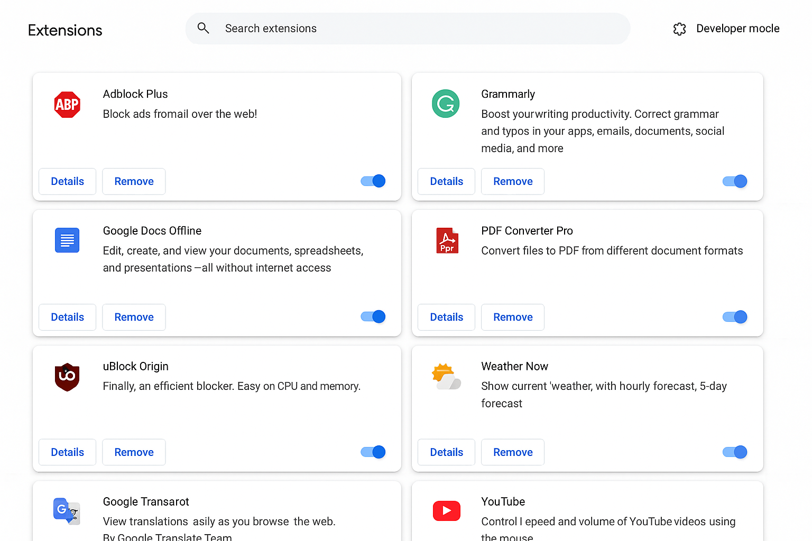
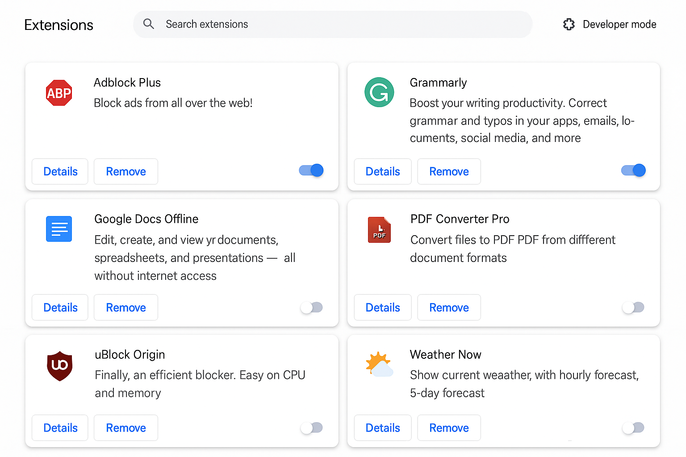

# 🛡️ Task 7: Identify and Remove Suspicious Browser Extensions

> ⚙️ **Cyber Security Internship Task - Browser Security Awareness**

---

## 📖 Overview

In today’s digital world, browser extensions enhance productivity — but can also pose **serious security threats** if misused. This task was designed to improve our awareness of **browser vulnerabilities** and practice how to spot, analyze, and remove **potentially malicious or unnecessary extensions**.

---

## 🎯 Objective

- Inspect all browser extensions installed in Google Chrome
- Identify suspicious or high-risk extensions
- Remove or disable unnecessary or unsafe ones
- Capture the **before** and **after** state as proof of task completion
- Learn and reflect on browser extension permissions and their implications

---

## 🛠️ Tools & Environment

| Tool               | Usage                          |
|--------------------|--------------------------------|
| 🧭 Google Chrome    | Browser used for extension review |
| 🧩 Chrome Extensions | `chrome://extensions`           |
| 🖼️ Screenshot Tool  | Documenting changes visually    |
| 📁 GitHub          | Submission and documentation    |

---

## 🧪 Steps Followed

### 1. Access Extension Manager  
Navigated to Chrome’s built-in extension page:
```
chrome://extensions
```

### 2. Reviewed Installed Extensions  
Checked:
- Name & legitimacy
- Publisher credibility
- Requested permissions
- Frequency of use

### 3. Identified Suspicious Extensions  
Two extensions were flagged:
- **PDF Converter Pro** — Unknown publisher; high access permissions
- **Weather Now** — Unused, requested location + browsing data

### 4. Removed Extensions  
Both were immediately removed to enhance privacy and reduce attack surface.

### 5. Restarted Browser  
Ensured the changes took effect and verified system performance.

---

## 📸 Screenshots

### 🔍 Before Removal


### ✅ After Removal


---

## 🧠 Key Learnings

- Extensions with broad permissions (e.g., **"Read and change all your data on all websites"**) can be very dangerous.
- Always **verify the publisher and reviews** before installing any extension.
- Regularly auditing your browser helps prevent data leaks and phishing risks.
- Even legit-looking extensions can be malicious — **stay cautious**!

---

## 📌 Interview-Ready Q&A

### 🔐 How can browser extensions be dangerous?
They can track your browsing, steal cookies, read passwords, inject ads, or even hijack sessions.

### 🚩 What permissions are considered suspicious?
- Full access to all websites
- Clipboard reading
- Tab management
- History manipulation

### 🔒 How to install extensions safely?
Only install from **trusted sources** (like the Chrome Web Store), read reviews, and check permissions before enabling.

### 🧱 What is extension sandboxing?
It’s a browser’s technique to isolate each extension in a controlled environment, minimizing harm if it misbehaves.

---

## 📂 Project Structure

```
task-7-browser-security/
├── README.md
└── screenshots/
    ├── before.png
    └── after.png
```

---

## 📎 Submission

This task was submitted as part of a cyber security internship and uploaded to GitHub for evaluation.

🔗 **GitHub Repo Link**: *[Add your repo link here]*  
📝 **Submission Form**: [Submit Here](https://forms.gle/8Gm83s53KbyXs3Ne9)

---

## 🚀 Bonus Tip

> “Browser extensions are like apps — if you wouldn’t install shady apps on your phone, don’t install shady extensions in your browser.”

---

## 🙌 Thanks for Reading!

Feel free to ⭐️ the repo if you found it useful. Stay secure!
